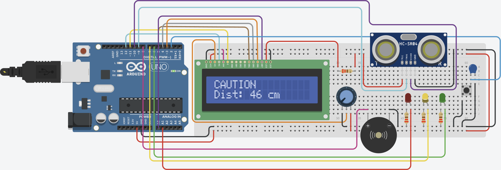

# 🚗 Smart Parking Assistance System

**Course:** ELEN4020 — Microcontrollers  
**Institution:** InterAmerican University of Puerto Rico  
**Team:** Pablo A. Rodríguez Ramos · Guillermo L. Rivera Matos

---

## Overview

A sensor-based parking assistant built on Arduino Uno R3 that detects vehicle proximity using an HC-SR04 ultrasonic sensor and provides real-time feedback through LEDs, a buzzer, and an LCD display. The system guides drivers into parking spaces using a three-zone alert model.

| Zone    | Distance      | LED    | Buzzer         |
|---------|---------------|--------|----------------|
| Safe    | > 50 cm       | Green  | Off            |
| Caution | 20 – 50 cm    | Yellow | Slow blink     |
| Danger  | < 20 cm       | Red    | Fast blink     |

---

## Circuit Simulation

View and interact with the circuit on TinkerCAD:  
🔗 [Smart Parking Assistance System — TinkerCAD](https://www.tinkercad.com/things/hxd40e0I5fD-smart-parking-assistance-system)

---

## Hardware

| Component          | Qty | Notes                           |
|--------------------|-----|---------------------------------|
| Arduino Uno R3     | 1   | Powered via USB (5V)            |
| HC-SR04            | 2   | 1 primary, 1 backup             |
| LCD 16×2 (I2C)     | 1   |                                 |
| LEDs (R, Y, G)     | 3   |                                 |
| Passive Buzzer     | 1   |                                 |
| Push Button        | 1   | Start/stop toggle (interrupt)   |
| Breadboard + Wires | —   | Larger board (kit was too small)|
| Resistors          | —   | For LEDs                        |

---

## Libraries

- [`LiquidCrystal.h`](https://www.arduino.cc/reference/en/libraries/liquidcrystal/) — LCD control (Arduino built-in)

---

## Features

- **Three-zone proximity logic** with distinct LED + buzzer behavior per zone
- **Noise filtering** — 5-sample average per reading to reduce false triggers
- **Non-blocking timing** via `millis()` (no `delay()` in main loop)
- **Interrupt-driven button** to toggle the system on/off
- **State machine** architecture for clean zone transitions
- **LCD feedback** showing real-time distance and current zone
- **Serial Monitor** debug output for development and testing

---

## How to Run

1. Wire the components as shown in the TinkerCAD simulation above.
2. Open `SmartParking.ino` in the Arduino IDE.
3. Select **Board:** Arduino Uno and the correct **Port**.
4. Click **Upload**.
5. Press the push button to start the system.
6. Open **Serial Monitor** (9600 baud) for debug output.

---
